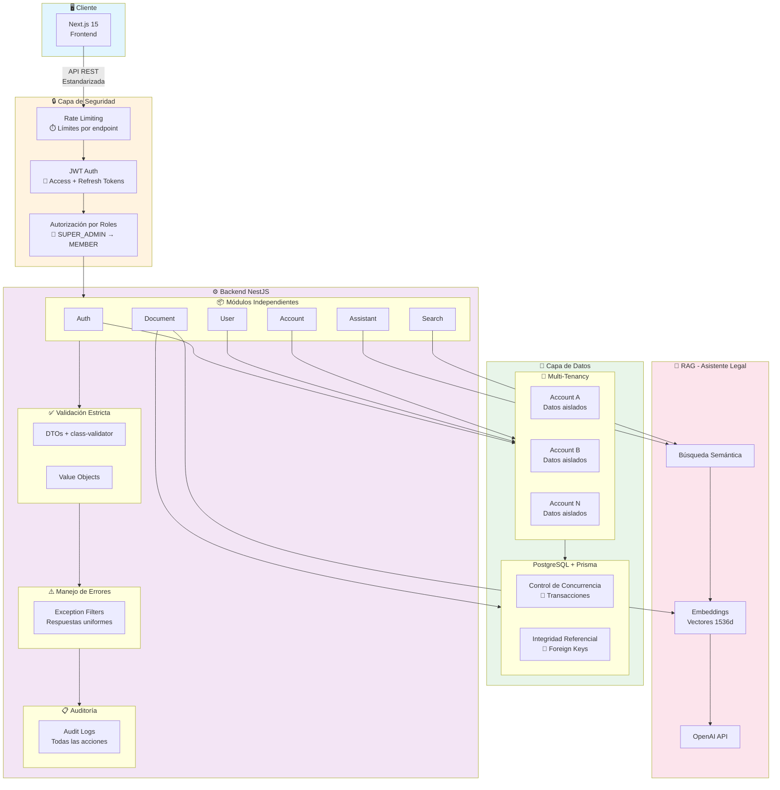
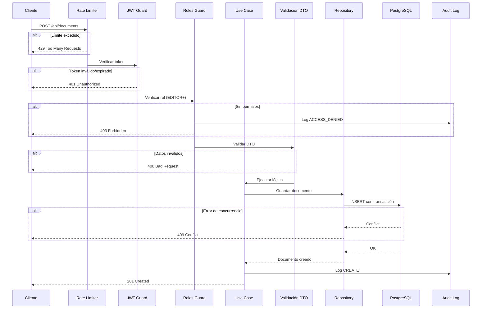
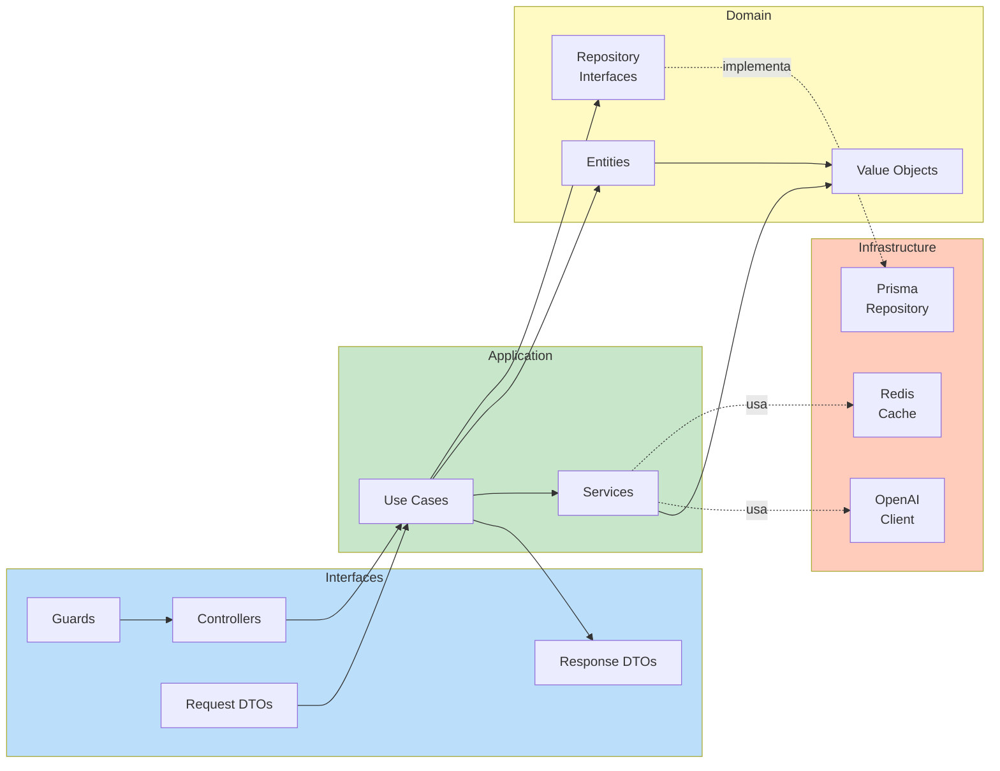
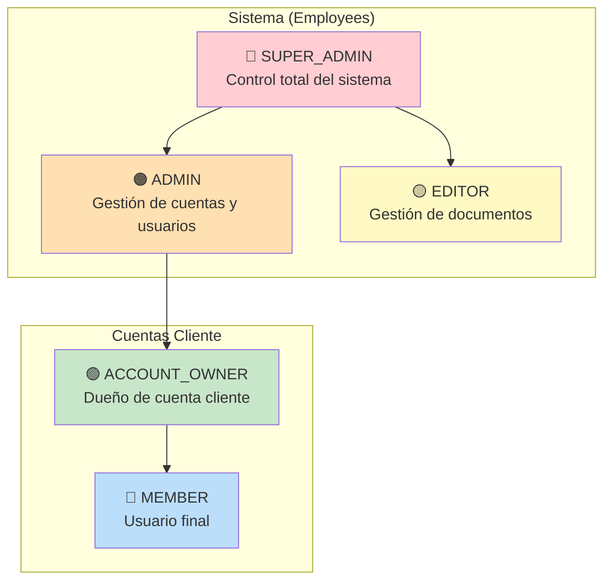
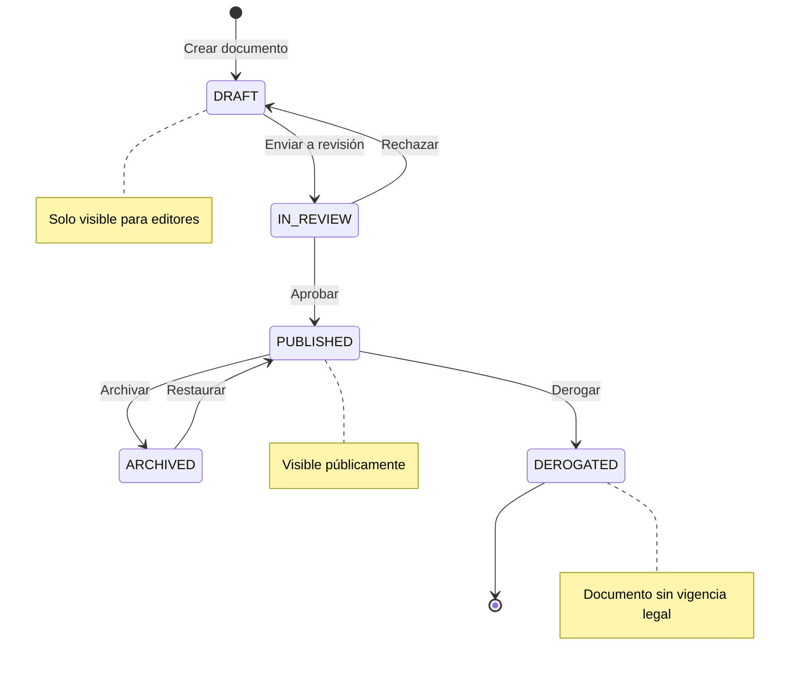
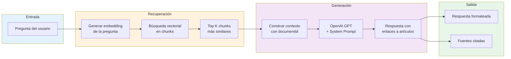
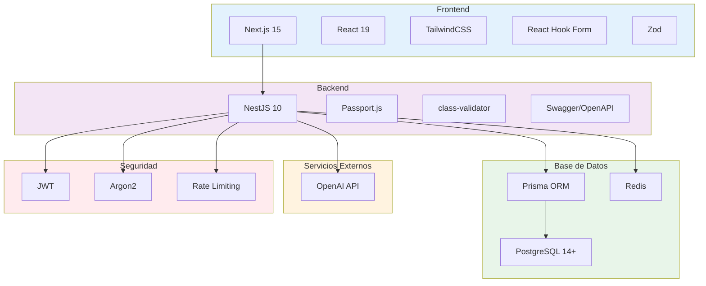

# Arquitectura del Sistema - AsistenciaLegal

## Características Principales

- **Arquitectura escalable** – El código está organizado para agregar nuevos módulos sin afectar los existentes.
- **Seguridad robusta** – JWT con refresh tokens, Argon2 para contraseñas, rate limiting y audit logs.
- **RAG funcional** – El asistente responde preguntas citando artículos específicos con enlaces.
- **Multi-tenancy** – Los datos de cada cliente están completamente aislados.
- **Integridad en la base de datos** – No hay consultas en fuentes externas.
- **Validación estricta de datos** – Cada módulo aplica reglas claras y consistentes.
- **API estandarizada** – Rutas, nombres y contratos unificados.
- **Manejo uniforme de errores** – Respuestas consistentes ante fallos.
- **Control de concurrencia** – Protección en operaciones sensibles.
- **Autorización por roles** – Políticas por módulo y nivel de acceso.

---

## Diagrama General de Arquitectura

---

## Flujo de una Petición

---

## Arquitectura de Capas (Clean Architecture)

---

## Jerarquía de Roles

---

## Ciclo de Vida de Documentos

---

## Flujo del Asistente RAG

---

## Stack Tecnológico

