# Arquitectura del Sistema - AsistenciaLegal

## Características Principales

- **Arquitectura escalable** – El código está organizado para agregar nuevos módulos sin afectar los existentes.
- **Seguridad robusta** – JWT con refresh tokens, Argon2 para contraseñas, rate limiting y audit logs.
- **RAG funcional** – El asistente responde preguntas citando artículos específicos con enlaces.
- **Multi-tenancy** – Los datos de cada cliente están completamente aislados.
- **Integridad en la base de datos** – No hay consultas en fuentes externas.
- **Validación estricta de datos** – Cada módulo aplica reglas claras y consistentes.
- **API estandarizada** – Rutas, nombres y contratos unificados.
- **Manejo uniforme de errores** – Respuestas consistentes ante fallos.
- **Control de concurrencia** – Protección en operaciones sensibles.
- **Autorización por roles** – Políticas por módulo y nivel de acceso.

---

## Diagrama General de Arquitectura

```mermaid
flowchart TB
    subgraph CLIENTE["🖥️ Cliente"]
        FE["Next.js 15<br/>Frontend"]
    end

    subgraph API["🔒 Capa de Seguridad"]
        RL["Rate Limiting<br/>⏱️ Límites por endpoint"]
        JWT["JWT Auth<br/>🔑 Access + Refresh Tokens"]
        RBAC["Autorización por Roles<br/>👥 SUPER_ADMIN → MEMBER"]
    end

    subgraph BACKEND["⚙️ Backend NestJS"]
        subgraph MODULES["📦 Módulos Independientes"]
            AUTH["Auth"]
            USER["User"]
            ACC["Account"]
            DOC["Document"]
            AST["Assistant"]
            SRC["Search"]
        end

        subgraph VALIDATION["✅ Validación Estricta"]
            DTO["DTOs + class-validator"]
            VO["Value Objects"]
        end

        subgraph ERRORS["⚠️ Manejo de Errores"]
            EF["Exception Filters<br/>Respuestas uniformes"]
        end

        subgraph AUDIT["📋 Auditoría"]
            LOG["Audit Logs<br/>Todas las acciones"]
        end
    end

    subgraph DATA["💾 Capa de Datos"]
        subgraph MT["🏢 Multi-Tenancy"]
            ACC1["Account A<br/>Datos aislados"]
            ACC2["Account B<br/>Datos aislados"]
            ACC3["Account N<br/>Datos aislados"]
        end

        subgraph DB["PostgreSQL + Prisma"]
            TX["Control de Concurrencia<br/>🔐 Transacciones"]
            FK["Integridad Referencial<br/>🔗 Foreign Keys"]
        end
    end

    subgraph AI["🤖 RAG - Asistente Legal"]
        EMB["Embeddings<br/>Vectores 1536d"]
        OAI["OpenAI API"]
        SEM["Búsqueda Semántica"]
    end

    FE -->|"API REST<br/>Estandarizada"| RL
    RL --> JWT
    JWT --> RBAC
    RBAC --> MODULES

    MODULES --> VALIDATION
    VALIDATION --> ERRORS
    ERRORS --> AUDIT

    AUTH & USER & ACC --> MT
    DOC --> DB
    DOC --> EMB
    AST --> SEM
    SEM --> EMB
    EMB --> OAI
    SRC --> SEM

    MT --> DB

    style CLIENTE fill:#e1f5fe
    style API fill:#fff3e0
    style BACKEND fill:#f3e5f5
    style DATA fill:#e8f5e9
    style AI fill:#fce4ec
```

---

## Flujo de una Petición

```mermaid
sequenceDiagram
    participant C as Cliente
    participant RL as Rate Limiter
    participant JWT as JWT Guard
    participant RG as Roles Guard
    participant UC as Use Case
    participant VAL as Validación DTO
    participant REPO as Repository
    participant DB as PostgreSQL
    participant AUDIT as Audit Log

    C->>RL: POST /api/documents

    alt Límite excedido
        RL-->>C: 429 Too Many Requests
    end

    RL->>JWT: Verificar token

    alt Token inválido/expirado
        JWT-->>C: 401 Unauthorized
    end

    JWT->>RG: Verificar rol (EDITOR+)

    alt Sin permisos
        RG->>AUDIT: Log ACCESS_DENIED
        RG-->>C: 403 Forbidden
    end

    RG->>VAL: Validar DTO

    alt Datos inválidos
        VAL-->>C: 400 Bad Request
    end

    VAL->>UC: Ejecutar lógica
    UC->>REPO: Guardar documento

    REPO->>DB: INSERT con transacción

    alt Error de concurrencia
        DB-->>REPO: Conflict
        REPO-->>C: 409 Conflict
    end

    DB-->>REPO: OK
    REPO-->>UC: Documento creado
    UC->>AUDIT: Log CREATE
    UC-->>C: 201 Created
```

---

## Arquitectura de Capas (Clean Architecture)

---

## Jerarquía de Roles

```mermaid
flowchart TD
    SA["🔴 SUPER_ADMIN<br/>Control total del sistema"]
    AD["🟠 ADMIN<br/>Gestión de cuentas y usuarios"]
    ED["🟡 EDITOR<br/>Gestión de documentos"]
    AO["🟢 ACCOUNT_OWNER<br/>Dueño de cuenta cliente"]
    MB["🔵 MEMBER<br/>Usuario final"]

    SA --> AD
    SA --> ED
    AD --> AO
    AO --> MB

    subgraph SYSTEM["Sistema (Employees)"]
        SA
        AD
        ED
    end

    subgraph CLIENTS["Cuentas Cliente"]
        AO
        MB
    end

    style SA fill:#ffcdd2
    style AD fill:#ffe0b2
    style ED fill:#fff9c4
    style AO fill:#c8e6c9
    style MB fill:#bbdefb
```

---

## Ciclo de Vida de Documentos

---

## Flujo del Asistente RAG

```mermaid
flowchart LR
    subgraph INPUT["Entrada"]
        Q["Pregunta del usuario"]
    end

    subgraph RETRIEVAL["Recuperación"]
        EMB["Generar embedding<br/>de la pregunta"]
        VS["Búsqueda vectorial<br/>en chunks"]
        TOP["Top K chunks<br/>más similares"]
    end

    subgraph GENERATION["Generación"]
        CTX["Construir contexto<br/>con documentId"]
        LLM["OpenAI GPT<br/>+ System Prompt"]
        ANS["Respuesta con<br/>enlaces a artículos"]
    end

    subgraph OUTPUT["Salida"]
        RES["Respuesta formateada"]
        SRC["Fuentes citadas"]
    end

    Q --> EMB
    EMB --> VS
    VS --> TOP
    TOP --> CTX
    CTX --> LLM
    LLM --> ANS
    ANS --> RES
    ANS --> SRC

    style INPUT fill:#e3f2fd
    style RETRIEVAL fill:#fff3e0
    style GENERATION fill:#f3e5f5
    style OUTPUT fill:#e8f5e9
```

---

## Stack Tecnológico

