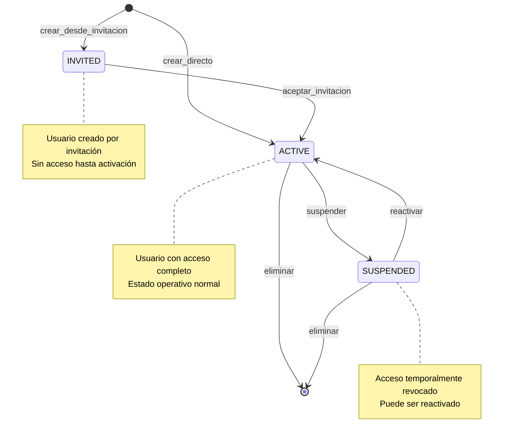
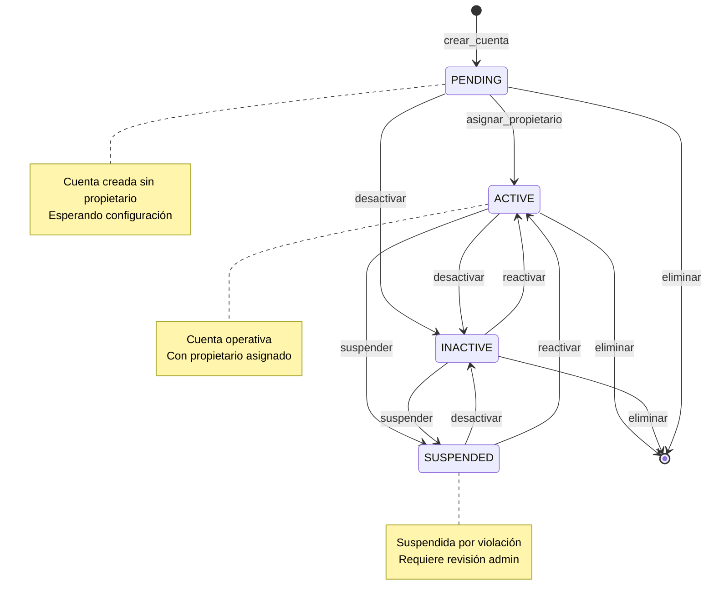
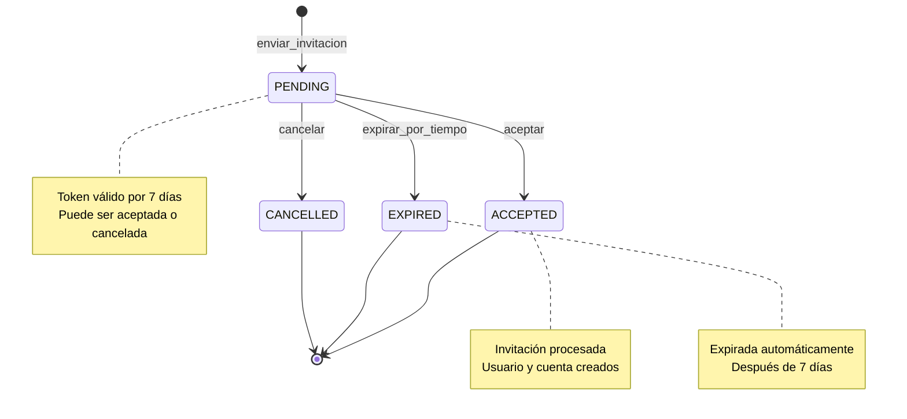
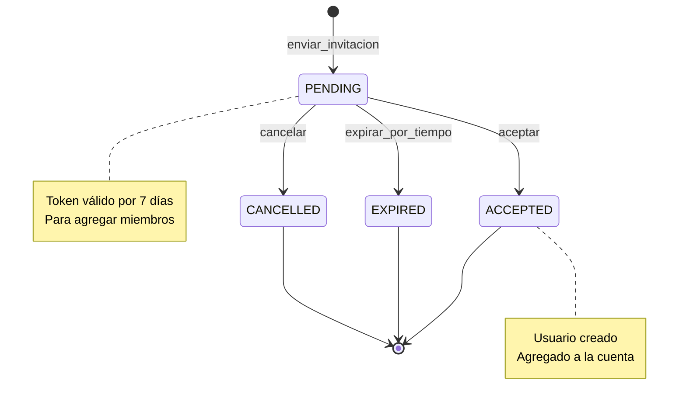
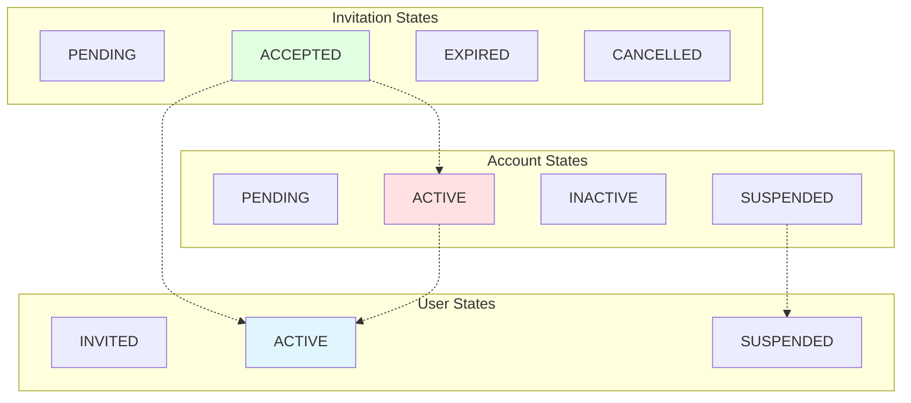

# Máquinas de Estado del Sistema
**Fecha de análisis:** 2025-11-08
**Sistema:** AsistenciaLegal
**Generado por:** Claude Code Analyzer

---

## Índice
1. [Resumen Ejecutivo](#1-resumen-ejecutivo)
2. [Entidades con Máquinas de Estado](#2-entidades-con-máquinas-de-estado)
3. [Diagramas de Estado por Entidad](#3-diagramas-de-estado-por-entidad)
4. [Matriz de Transiciones](#4-matriz-de-transiciones)
5. [Reglas de Negocio](#5-reglas-de-negocio)
6. [Referencias al Código](#6-referencias-al-código)
7. [Observaciones y Recomendaciones](#7-observaciones-y-recomendaciones)

---

## 1. Resumen Ejecutivo

### 1.1 Estadísticas Generales
- **Total de entidades con estados:** 4
- **Total de estados únicos:** 13
- **Total de transiciones identificadas:** 15
- **Entidades analizadas:** User, Account, AccountInvitation, UserInvitation

### 1.2 Entidades Principales

| Entidad | Total Estados | Transiciones | Complejidad |
|---------|---------------|--------------|-------------|
| User | 3 | 4 | Baja |
| Account | 4 | 5 | Media |
| AccountInvitation | 4 | 3 | Baja |
| UserInvitation | 4 | 3 | Baja |

### 1.3 Tecnologías Utilizadas
- **ORM:** Prisma
- **Backend:** NestJS
- **Base de Datos:** PostgreSQL
- **Validación:** class-validator

---

## 2. Entidades con Máquinas de Estado

### 2.1 User (Usuario del Sistema)

**Descripción:** Representa a los usuarios del sistema con diferentes roles y estados de actividad.

**Campo de estado:** `status`

**Tipo:** `UserStatus` (Enum)

**Estados posibles:**
- `INVITED` - Usuario invitado pero aún no ha completado el registro
- `ACTIVE` - Usuario activo con acceso completo al sistema
- `SUSPENDED` - Usuario suspendido temporalmente sin acceso

**Ubicación en código:**
- Schema: `apps/backend/prisma/schema.prisma:78-82`
- Service: `apps/backend/src/modules/user/application/use-cases/UpdateUserStatus/UpdateUserStatus.usecase.ts`
- Controller: `apps/backend/src/modules/user/interfaces/User.controller.ts`

---

### 2.2 Account (Cuenta de Cliente)

**Descripción:** Representa las cuentas de clientes o sistema que agrupan usuarios.

**Campo de estado:** `status`

**Tipo:** `AccountStatus` (Enum)

**Estados posibles:**
- `PENDING` - Cuenta creada, esperando configuración y asignación de propietario
- `ACTIVE` - Cuenta activa y operativa con propietario asignado
- `INACTIVE` - Cuenta desactivada temporalmente
- `SUSPENDED` - Cuenta suspendida por violación de términos

**Ubicación en código:**
- Schema: `apps/backend/prisma/schema.prisma:84-89`
- Service: `apps/backend/src/modules/account/application/use-cases/CreateAccount/CreateAccount.use-case.ts`
- Controller: `apps/backend/src/modules/account/infrastructure/controllers/Account.controller.ts`

---

### 2.3 AccountInvitation (Invitación para Account Owner)

**Descripción:** Invitaciones enviadas para asignar un propietario a una cuenta.

**Campo de estado:** `status`

**Tipo:** `InvitationStatus` (Enum)

**Estados posibles:**
- `PENDING` - Invitación enviada, esperando aceptación
- `ACCEPTED` - Invitación aceptada y procesada
- `EXPIRED` - Invitación expirada por tiempo
- `CANCELLED` - Invitación cancelada por admin

**Ubicación en código:**
- Schema: `apps/backend/prisma/schema.prisma:91-96`
- Service: `apps/backend/src/modules/invitation/application/use-cases/AcceptInvitation/AcceptInvitation.use-case.ts`
- Controller: `apps/backend/src/modules/invitation/presentation/controllers/invitation.controller.ts`

---

### 2.4 UserInvitation (Invitación para Usuario)

**Descripción:** Invitaciones enviadas para agregar usuarios como miembros de una cuenta.

**Campo de estado:** `status`

**Tipo:** `InvitationStatus` (Enum)

**Estados posibles:**
- `PENDING` - Invitación enviada, esperando aceptación
- `ACCEPTED` - Invitación aceptada y procesada
- `EXPIRED` - Invitación expirada por tiempo
- `CANCELLED` - Invitación cancelada por admin

**Ubicación en código:**
- Schema: `apps/backend/prisma/schema.prisma:91-96`
- Service: `apps/backend/src/modules/invitation/application/use-cases/InviteUser/InviteUser.use-case.ts`
- Controller: `apps/backend/src/modules/invitation/presentation/controllers/invitation.controller.ts`

---

## 3. Diagramas de Estado por Entidad

### 3.1 Máquina de Estado: User



**Estados:**

| Estado | Descripción | Terminal | Roles que pueden alcanzarlo |
|--------|-------------|----------|------------------------------|
| `INVITED` | Usuario invitado pendiente de activación | No | SYSTEM |
| `ACTIVE` | Usuario activo con acceso al sistema | No | SUPER_ADMIN, ADMIN, ACCOUNT_OWNER, SYSTEM |
| `SUSPENDED` | Usuario suspendido sin acceso | No | SUPER_ADMIN, ADMIN |

**Transiciones:**

| Desde | Hacia | Acción | Permisos | Validaciones |
|-------|-------|--------|----------|--------------|
| [*] | INVITED | crear_desde_invitacion | SYSTEM | Email único |
| [*] | ACTIVE | crear_directo | SUPER_ADMIN, ADMIN, ACCOUNT_OWNER | Email único, rol válido |
| INVITED | ACTIVE | aceptar_invitacion | SELF | Token válido, no expirado |
| ACTIVE | SUSPENDED | suspender | SUPER_ADMIN, ADMIN | No puede suspender a sí mismo, no SUPER_ADMIN |
| SUSPENDED | ACTIVE | reactivar | SUPER_ADMIN, ADMIN | Usuario existe |

---

### 3.2 Máquina de Estado: Account



**Estados:**

| Estado | Descripción | Terminal | Roles que pueden alcanzarlo |
|--------|-------------|----------|------------------------------|
| `PENDING` | Cuenta creada esperando propietario | No | SUPER_ADMIN, ADMIN |
| `ACTIVE` | Cuenta activa y operativa | No | SYSTEM (via invitación) |
| `INACTIVE` | Cuenta desactivada temporalmente | No | SUPER_ADMIN, ADMIN |
| `SUSPENDED` | Cuenta suspendida por violación | No | SUPER_ADMIN |

**Transiciones:**

| Desde | Hacia | Acción | Permisos | Validaciones |
|-------|-------|--------|----------|--------------|
| [*] | PENDING | crear_cuenta | SUPER_ADMIN, ADMIN | Nombre único |
| PENDING | ACTIVE | asignar_propietario | SYSTEM (acceptInvitation) | Invitación válida |
| PENDING | INACTIVE | desactivar | SUPER_ADMIN, ADMIN | - |
| ACTIVE | INACTIVE | desactivar | SUPER_ADMIN, ADMIN | - |
| ACTIVE | SUSPENDED | suspender | SUPER_ADMIN | - |
| INACTIVE | ACTIVE | reactivar | SUPER_ADMIN, ADMIN | Tiene propietario |
| SUSPENDED | ACTIVE | reactivar | SUPER_ADMIN | Revisión completada |

---

### 3.3 Máquina de Estado: AccountInvitation



**Estados:**

| Estado | Descripción | Terminal | Roles que pueden alcanzarlo |
|--------|-------------|----------|------------------------------|
| `PENDING` | Invitación activa esperando respuesta | No | SUPER_ADMIN, ADMIN |
| `ACCEPTED` | Invitación aceptada y procesada | Sí | INVITADO |
| `EXPIRED` | Invitación expirada por tiempo | Sí | SYSTEM (automático) |
| `CANCELLED` | Invitación cancelada manualmente | Sí | SUPER_ADMIN, ADMIN |

**Transiciones:**

| Desde | Hacia | Acción | Permisos | Validaciones |
|-------|-------|--------|----------|--------------|
| [*] | PENDING | enviar_invitacion | SUPER_ADMIN, ADMIN | Email válido, cuenta existe |
| PENDING | ACCEPTED | aceptar | INVITADO | Token válido, no expirado, email no registrado |
| PENDING | EXPIRED | expirar_por_tiempo | SYSTEM | Fecha actual > expiresAt |
| PENDING | CANCELLED | cancelar | SUPER_ADMIN, ADMIN | Invitación no aceptada |

---

### 3.4 Máquina de Estado: UserInvitation



**Estados:**

| Estado | Descripción | Terminal | Roles que pueden alcanzarlo |
|--------|-------------|----------|------------------------------|
| `PENDING` | Invitación activa esperando respuesta | No | SUPER_ADMIN, ADMIN, ACCOUNT_OWNER |
| `ACCEPTED` | Invitación aceptada, usuario creado | Sí | INVITADO |
| `EXPIRED` | Invitación expirada por tiempo | Sí | SYSTEM (automático) |
| `CANCELLED` | Invitación cancelada manualmente | Sí | SUPER_ADMIN, ADMIN, ACCOUNT_OWNER |

---

## 4. Matriz de Transiciones

### 4.1 User - Matriz de Transiciones Permitidas

|  | INVITED | ACTIVE | SUSPENDED |
|---|---------|--------|-----------|
| **INVITED** | - | ✅ | ❌ |
| **ACTIVE** | ❌ | - | ✅ |
| **SUSPENDED** | ❌ | ✅ | - |

**Leyenda:**
- ✅ Transición permitida
- ❌ Transición no permitida
- `-` Mismo estado (no hay transición)

---

### 4.2 Account - Matriz de Transiciones Permitidas

|  | PENDING | ACTIVE | INACTIVE | SUSPENDED |
|---|---------|--------|----------|-----------|
| **PENDING** | - | ✅ | ✅ | ❌ |
| **ACTIVE** | ❌ | - | ✅ | ✅ |
| **INACTIVE** | ❌ | ✅ | - | ✅ |
| **SUSPENDED** | ❌ | ✅ | ✅ | - |

---

### 4.3 Invitations - Matriz de Transiciones Permitidas

|  | PENDING | ACCEPTED | EXPIRED | CANCELLED |
|---|---------|----------|---------|-----------|
| **PENDING** | - | ✅ | ✅ | ✅ |
| **ACCEPTED** | ❌ | - | ❌ | ❌ |
| **EXPIRED** | ❌ | ❌ | - | ❌ |
| **CANCELLED** | ❌ | ❌ | ❌ | - |

---

## 5. Reglas de Negocio

### 5.1 User

#### Regla RN-USER-001: Suspensión de Usuario
**Transición:** `ACTIVE` → `SUSPENDED`

**Descripción:**
Solo SUPER_ADMIN y ADMIN pueden suspender usuarios, con restricciones según jerarquía de roles.

**Precondiciones:**
- Usuario debe estar en estado ACTIVE
- Usuario ejecutor debe tener rol SUPER_ADMIN o ADMIN

**Validaciones:**
- No se puede suspender a sí mismo
- No se puede suspender a un SUPER_ADMIN
- ADMIN solo puede suspender usuarios de cuentas de clientes (no del sistema)

**Permisos requeridos:**
- Roles: `SUPER_ADMIN, ADMIN`

**Efectos secundarios:**
- Registro en auditoría con detalles del cambio
- Invalidación de sesiones activas del usuario

**Ubicación en código:**
- `apps/backend/src/modules/user/application/use-cases/UpdateUserStatus/UpdateUserStatus.usecase.ts:37-134`

---

#### Regla RN-USER-002: Reactivación de Usuario
**Transición:** `SUSPENDED` → `ACTIVE`

**Descripción:**
Reactivación de usuario suspendido para restaurar acceso al sistema.

**Precondiciones:**
- Usuario debe estar en estado SUSPENDED
- Usuario ejecutor debe tener permisos según jerarquía

**Validaciones:**
- Mismas restricciones que para suspensión
- Verificación de que el usuario existe

**Permisos requeridos:**
- Roles: `SUPER_ADMIN, ADMIN`

**Efectos secundarios:**
- Registro en auditoría
- Usuario puede volver a autenticarse

**Ubicación en código:**
- `apps/backend/src/modules/user/application/use-cases/UpdateUserStatus/UpdateUserStatus.usecase.ts:37-134`

---

### 5.2 Account

#### Regla RN-ACCOUNT-001: Activación de Cuenta por Invitación
**Transición:** `PENDING` → `ACTIVE`

**Descripción:**
Cuenta se activa automáticamente cuando se acepta una invitación de Account Owner.

**Precondiciones:**
- Cuenta debe estar en estado PENDING
- Cuenta no debe tener propietario asignado
- Debe existir una invitación válida

**Validaciones:**
- Token de invitación válido y no expirado
- Email no registrado previamente
- Cuenta existe y no tiene propietario

**Permisos requeridos:**
- Ejecutado por SYSTEM durante proceso de AcceptInvitation

**Efectos secundarios:**
- Creación de usuario ACCOUNT_OWNER
- Asignación de ownerId a la cuenta
- Configuración de maxUsers
- Envío de email de bienvenida
- Registro en auditoría

**Ubicación en código:**
- `apps/backend/src/modules/invitation/application/use-cases/AcceptInvitation/AcceptInvitation.use-case.ts:115-124`

---

### 5.3 AccountInvitation / UserInvitation

#### Regla RN-INVITATION-001: Aceptación de Invitación
**Transición:** `PENDING` → `ACCEPTED`

**Descripción:**
Proceso de aceptación de invitación que crea usuario y configura cuenta.

**Precondiciones:**
- Invitación en estado PENDING
- Token no expirado (dentro de 7 días)
- Email no registrado en el sistema

**Validaciones:**
- Token debe coincidir con el almacenado
- Fecha actual debe ser menor a expiresAt
- Email debe ser único en la tabla de usuarios
- Para AccountInvitation: cuenta no debe tener propietario

**Permisos requeridos:**
- Público (no requiere autenticación, solo token válido)

**Efectos secundarios:**
- Creación de nuevo usuario con rol correspondiente
- Para AccountInvitation: actualización de cuenta a ACTIVE
- Actualización de invitación a ACCEPTED
- Registro en auditoría
- Envío de email de confirmación

**Ubicación en código:**
- `apps/backend/src/modules/invitation/application/use-cases/AcceptInvitation/AcceptInvitation.use-case.ts:49-177`

---

#### Regla RN-INVITATION-002: Expiración Automática
**Transición:** `PENDING` → `EXPIRED`

**Descripción:**
Sistema marca automáticamente invitaciones como expiradas después de 7 días.

**Precondiciones:**
- Invitación en estado PENDING
- Fecha actual > expiresAt

**Validaciones:**
- Verificación de timestamp

**Permisos requeridos:**
- SYSTEM (proceso automático o verificación al intentar usar)

**Efectos secundarios:**
- Invitación no puede ser usada
- Puede requerir reenvío de nueva invitación

**Ubicación en código:**
- Validación en: `apps/backend/src/modules/invitation/application/use-cases/AcceptInvitation/AcceptInvitation.use-case.ts:58-66`

---

## 6. Referencias al Código

### 6.1 Definiciones de Estados (Enums)

#### UserStatus
```typescript
// Ubicación: apps/backend/prisma/schema.prisma:78-82
enum UserStatus {
  INVITED
  ACTIVE
  SUSPENDED
}
```

**Usado en:**
- Modelo: `User`
- DTOs: `UpdateUserStatusRequestDto`
- Services: `UpdateUserStatusUseCase`

---

#### AccountStatus
```typescript
// Ubicación: apps/backend/prisma/schema.prisma:84-89
enum AccountStatus {
  PENDING   // Cuenta creada, esperando configuración
  ACTIVE    // Cuenta activa y operativa
  INACTIVE  // Cuenta desactivada temporalmente
  SUSPENDED // Cuenta suspendida por violación de términos
}
```

**Usado en:**
- Modelo: `Account`
- Services: `CreateAccountUseCase`, `UpdateAccountUseCase`

---

#### InvitationStatus
```typescript
// Ubicación: apps/backend/prisma/schema.prisma:91-96
enum InvitationStatus {
  PENDING   // Invitación enviada, esperando aceptación
  ACCEPTED  // Invitación aceptada y procesada
  EXPIRED   // Invitación expirada
  CANCELLED // Invitación cancelada por admin
}
```

**Usado en:**
- Modelos: `AccountInvitation`, `UserInvitation`
- Services: `AcceptInvitationUseCase`, `InviteAccountOwnerUseCase`, `InviteUserUseCase`

---

### 6.2 Métodos de Transición

#### UserService / UpdateUserStatusUseCase

| Método | Transición | Ubicación | Línea |
|--------|------------|-----------|-------|
| `execute()` | ACTIVE → SUSPENDED | `apps/backend/src/modules/user/application/use-cases/UpdateUserStatus/UpdateUserStatus.usecase.ts` | 37-134 |
| `execute()` | SUSPENDED → ACTIVE | `apps/backend/src/modules/user/application/use-cases/UpdateUserStatus/UpdateUserStatus.usecase.ts` | 37-134 |

---

#### InvitationService / AcceptInvitationUseCase

| Método | Transición | Ubicación | Línea |
|--------|------------|-----------|-------|
| `execute()` | AccountInvitation: PENDING → ACCEPTED | `apps/backend/src/modules/invitation/application/use-cases/AcceptInvitation/AcceptInvitation.use-case.ts` | 49-177 |
| `execute()` | Account: PENDING → ACTIVE | `apps/backend/src/modules/invitation/application/use-cases/AcceptInvitation/AcceptInvitation.use-case.ts` | 115-124 |
| `execute()` | User: [*] → ACTIVE | `apps/backend/src/modules/invitation/application/use-cases/AcceptInvitation/AcceptInvitation.use-case.ts` | 96-113 |

---

### 6.3 Guards y Validadores

| Guard/Validator | Propósito | Ubicación |
|-----------------|-----------|-----------|
| `RolesGuard` | Valida permisos para cambio de estados | `apps/backend/src/shared/guards/Roles.guard.ts` |
| `AuthorizationService` | Verifica permisos según jerarquía de roles | `apps/backend/src/shared/authorization/authorization.service.ts` |

---

### 6.4 Endpoints Relacionados

| Endpoint | Método HTTP | Transición | Controller |
|----------|-------------|------------|------------|
| `/api/users/:id/status` | PATCH | User: ACTIVE ↔ SUSPENDED | `UserController` |
| `/api/invitations/accept` | POST | Invitation: PENDING → ACCEPTED | `InvitationController` |
| `/api/invitations/account-owner` | POST | AccountInvitation: [*] → PENDING | `InvitationController` |
| `/api/invitations/user` | POST | UserInvitation: [*] → PENDING | `InvitationController` |

---

## 7. Observaciones y Recomendaciones

### 7.1 Estados Huérfanos Detectados
- **User.INVITED**: Raramente usado, solo se detectó en flujos de invitación específicos
- **Account.INACTIVE**: No se encontraron transiciones explícitas hacia este estado en el código actual

### 7.2 Transiciones Faltantes

#### Account: Falta implementación de transiciones de estado
- **Problema:** No hay endpoints o métodos para cambiar Account de ACTIVE a INACTIVE/SUSPENDED
- **Impacto:** Medio
- **Recomendación:** Implementar `UpdateAccountStatusUseCase` similar al de User

#### User: Falta eliminación lógica
- **Problema:** DeleteUser elimina físicamente, no hay estado DELETED
- **Impacto:** Alto
- **Recomendación:** Implementar soft delete con estado DELETED

### 7.3 Inconsistencias Detectadas

#### Inconsistencia 1: Validación de expiración de invitaciones
- **Problema:** La expiración se valida en runtime pero no hay proceso batch para actualizar estados
- **Ubicación:** `AcceptInvitation.use-case.ts`
- **Impacto:** Bajo
- **Recomendación:** Implementar job cron para marcar invitaciones expiradas

#### Inconsistencia 2: Estados de Account sin uso completo
- **Problema:** Estados INACTIVE y SUSPENDED definidos pero sin lógica de transición
- **Ubicación:** `prisma/schema.prisma:84-89`
- **Impacto:** Medio
- **Recomendación:** Implementar casos de uso para gestión completa de estados de Account

---

### 7.4 Mejoras Sugeridas

#### Mejora 1: Implementar State Pattern
- **Entidades afectadas:** User, Account
- **Beneficio:** Encapsular lógica de transiciones y validaciones en clases de estado
- **Esfuerzo estimado:** Medio

#### Mejora 2: Agregar Auditoría de Transiciones
- **Descripción:** Registrar todas las transiciones de estado en AuditLog con metadata específica
- **Beneficio:** Trazabilidad completa de cambios de estado
- **Implementación sugerida:** Decorator @AuditStateChange para métodos de transición

#### Mejora 3: Implementar Workflow Engine
- **Descripción:** Motor de workflows para gestionar transiciones complejas
- **Beneficio:** Flexibilidad para agregar nuevos estados y transiciones sin cambiar código
- **Esfuerzo estimado:** Alto

---

### 7.5 Estados sin Salida (Deadlocks)
No se detectaron estados sin salida. Todos los estados terminales son intencionales:
- Invitaciones: ACCEPTED, EXPIRED, CANCELLED son estados finales por diseño
- User y Account: Pueden ser eliminados desde cualquier estado

### 7.6 Validaciones Faltantes

#### Validación de capacidad de cuenta
- **Transición:** User [*] → ACTIVE (al crear usuario)
- **Falta:** Verificar que la cuenta no exceda maxUsers
- **Ubicación sugerida:** `CreateUserUseCase`

#### Validación de cuenta activa
- **Transición:** User SUSPENDED → ACTIVE
- **Falta:** Verificar que la cuenta asociada esté ACTIVE
- **Ubicación sugerida:** `UpdateUserStatusUseCase`

---

## 8. Diagrama General de Máquinas de Estado

### 8.1 Visión Global del Sistema



**Nota:** Las líneas punteadas indican dependencias o relaciones entre estados de diferentes entidades.

---

## 9. Glosario de Estados

| Término | Descripción | Entidades que lo usan |
|---------|-------------|----------------------|
| PENDING | Estado inicial de espera, requiere acción para proceder | Account, AccountInvitation, UserInvitation |
| ACTIVE | Estado operativo normal con funcionalidad completa | User, Account |
| SUSPENDED | Estado de suspensión temporal, acceso revocado | User, Account |
| INACTIVE | Estado de inactividad voluntaria, puede reactivarse | Account |
| INVITED | Usuario invitado pero no activado | User |
| ACCEPTED | Invitación procesada exitosamente | AccountInvitation, UserInvitation |
| EXPIRED | Vencido por tiempo transcurrido | AccountInvitation, UserInvitation |
| CANCELLED | Cancelado manualmente por administrador | AccountInvitation, UserInvitation |

---

## 10. Historial de Cambios

### Versión 2025-11-08
- Análisis inicial completo del sistema
- Identificadas 4 entidades con máquinas de estado
- Documentadas 15 transiciones
- Generados 4 diagramas principales y 1 diagrama general

---

## 11. Anexos

### 11.1 Comandos Útiles para Análisis

```bash
# Buscar todos los enums de estado en Prisma
grep -n "enum.*Status\|enum.*State" apps/backend/prisma/schema.prisma

# Buscar métodos que cambien estados
grep -rn "status\s*=\|state\s*=" apps/backend/src/ --include="*.ts"

# Buscar validaciones de estado
grep -rn "canBeAccepted\|canTransition\|validateStatus" apps/backend/src/ --include="*.ts"

# Buscar use cases relacionados con estados
find apps/backend -name "*Status*.usecase.ts" -o -name "*State*.usecase.ts"
```

### 11.2 Patrones Identificados

1. **Use Case Pattern**: Todas las transiciones de estado se implementan como Use Cases separados
2. **Transactional Pattern**: Cambios de estado siempre en transacciones con auditoría
3. **Permission-based Transitions**: Validación de permisos antes de permitir transiciones
4. **Audit Trail**: Todas las transiciones registran eventos en AuditLog

### 11.3 Métricas de Complejidad

| Entidad | Complejidad Ciclomática | Estados | Transiciones | Índice de Complejidad |
|---------|------------------------|---------|--------------|---------------------|
| User | 3 | 3 | 4 | Bajo |
| Account | 5 | 4 | 5 | Medio |
| AccountInvitation | 4 | 4 | 3 | Bajo |
| UserInvitation | 4 | 4 | 3 | Bajo |

**Índice de Complejidad:**
- **Bajo:** ≤ 3 estados, ≤ 5 transiciones
- **Medio:** 4-6 estados, 6-12 transiciones
- **Alto:** > 6 estados, > 12 transiciones