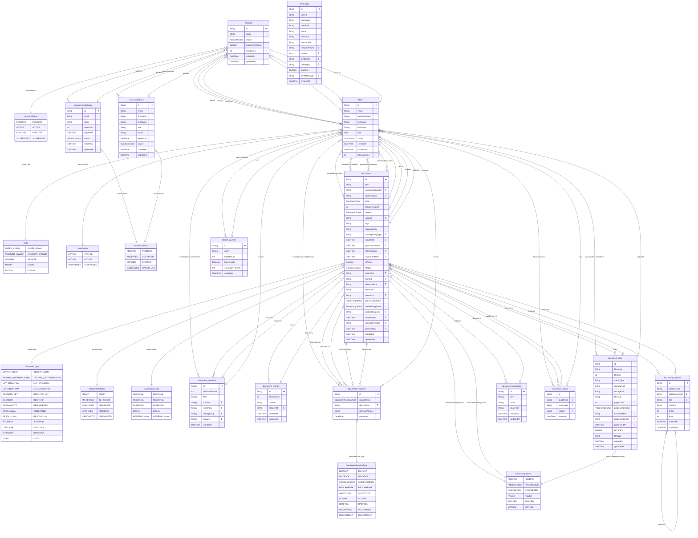

```mermaid
erDiagram

        Role {
            SUPER_ADMIN SUPER_ADMIN
ACCOUNT_OWNER ACCOUNT_OWNER
MEMBER MEMBER
ADMIN ADMIN
EDITOR EDITOR
        }
    


        UserStatus {
            INVITED INVITED
ACTIVE ACTIVE
SUSPENDED SUSPENDED
        }
    


        AccountStatus {
            PENDING PENDING
ACTIVE ACTIVE
INACTIVE INACTIVE
SUSPENDED SUSPENDED
        }
    


        InvitationStatus {
            PENDING PENDING
ACCEPTED ACCEPTED
EXPIRED EXPIRED
CANCELLED CANCELLED
        }
    


        DocumentType {
            CONSTITUCION CONSTITUCION
TRATADO_INTERNACIONAL TRATADO_INTERNACIONAL
LEY_ORGANICA LEY_ORGANICA
LEY_ORDINARIA LEY_ORDINARIA
DECRETO_LEY DECRETO_LEY
DECRETO DECRETO
REGLAMENTO REGLAMENTO
ORDENANZA ORDENANZA
RESOLUCION RESOLUCION
ACUERDO ACUERDO
CIRCULAR CIRCULAR
DIRECTIVA DIRECTIVA
OTRO OTRO
        }
    


        DocumentStatus {
            DRAFT DRAFT
IN_REVIEW IN_REVIEW
PUBLISHED PUBLISHED
ARCHIVED ARCHIVED
DEROGATED DEROGATED
        }
    


        DocumentRelationType {
            DEROGA DEROGA
MODIFICA MODIFICA
COMPLEMENTA COMPLEMENTA
REGLAMENTA REGLAMENTA
SUSTITUYE SUSTITUYE
ACLARA ACLARA
RATIFICA RATIFICA
INCORPORA INCORPORA
DESARROLLA DESARROLLA
        }
    


        ProcessingStatus {
            PENDING PENDING
PROCESSING PROCESSING
COMPLETED COMPLETED
FAILED FAILED
SKIPPED SKIPPED
MANUAL MANUAL
        }
    


        DocumentScope {
            NACIONAL NACIONAL
REGIONAL REGIONAL
MUNICIPAL MUNICIPAL
LOCAL LOCAL
INTERNACIONAL INTERNACIONAL
        }
    
  "Account" {
    String id "🗝️"
    String name 
    AccountStatus status 
    Boolean isSystemAccount 
    Int maxUsers "❓"
    DateTime createdAt 
    DateTime updatedAt 
    }
  

  "User" {
    String id "🗝️"
    String email 
    String passwordHash 
    String firstName 
    String lastName 
    Role role 
    UserStatus status 
    DateTime createdAt 
    DateTime updatedAt 
    Int tokenVersion 
    }
  

  "account_invitations" {
    String id "🗝️"
    String email 
    String token 
    Int maxUsers 
    DateTime expiresAt 
    InvitationStatus status 
    DateTime createdAt 
    DateTime updatedAt 
    }
  

  "user_invitations" {
    String id "🗝️"
    String email 
    String firstName 
    String lastName 
    String role 
    String token 
    DateTime expiresAt 
    InvitationStatus status 
    DateTime createdAt 
    DateTime updatedAt 
    }
  

  "audit_logs" {
    String id "🗝️"
    String userId 
    String userEmail 
    String userRole 
    String action 
    String resource 
    String resourceId 
    String resourceName "❓"
    Json details "❓"
    String ipAddress "❓"
    String userAgent "❓"
    Boolean success 
    String errorMessage "❓"
    DateTime createdAt 
    }
  

  "documents" {
    String id "🗝️"
    String title 
    String documentNumber "❓"
    String abbreviation "❓"
    DocumentType type 
    Int hierarchyLevel 
    DocumentScope scope 
    String subject "❓"
    String tags 
    String issuingEntity 
    String issuingEntityType "❓"
    DateTime issueDate "❓"
    DateTime publicationDate "❓"
    DateTime effectiveDate "❓"
    DateTime expirationDate "❓"
    Boolean isActive 
    DocumentStatus status 
    String summary "❓"
    String fullText "❓"
    String observations "❓"
    String keywords 
    String sourceUrl "❓"
    ProcessingStatus processingStatus 
    ProcessingStatus embeddingStatus 
    String embeddingError "❓"
    DateTime reviewedAt "❓"
    String rejectionReason "❓"
    DateTime publishedAt "❓"
    DateTime createdAt 
    DateTime updatedAt 
    }
  

  "document_versions" {
    String id "🗝️"
    Int versionNumber 
    String title 
    String fullText "❓"
    String summary "❓"
    String changeLog "❓"
    String reason "❓"
    DateTime createdAt 
    }
  

  "document_chunks" {
    String id "🗝️"
    Int chunkIndex 
    String content 
    String articleRef "❓"
    DateTime createdAt 
    DateTime updatedAt 
    }
  

  "document_sections" {
    String id "🗝️"
    String sectionType 
    String sectionNumber "❓"
    String title "❓"
    String content 
    Int order 
    Int level 
    DateTime createdAt 
    DateTime updatedAt 
    }
  

  "document_files" {
    String id "🗝️"
    String fileName 
    Int fileSize 
    String mimeType 
    String storagePath 
    String storageUrl "❓"
    String fileHash 
    Int pageCount "❓"
    ProcessingStatus processingStatus 
    String extractedText "❓"
    String processingError "❓"
    DateTime processedAt "❓"
    Boolean isPrimary 
    String fileType 
    DateTime createdAt 
    DateTime updatedAt 
    }
  

  "document_relations" {
    String id "🗝️"
    DocumentRelationType relationType 
    String description "❓"
    String affectedArticles 
    DateTime createdAt 
    }
  

  "document_metadata" {
    String id "🗝️"
    String key 
    String value 
    String dataType 
    DateTime createdAt 
    DateTime updatedAt 
    }
  

  "search_queries" {
    String id "🗝️"
    String query 
    Int totalResults 
    Boolean hasResults 
    Int executionTimeMs 
    DateTime createdAt 
    }
  

  "document_views" {
    String id "🗝️"
    String ipAddress "❓"
    String userAgent "❓"
    String referer "❓"
    DateTime viewedAt 
    }
  
    "Account" o|--|| "AccountStatus" : "enum:status"
    "Account" o|--|o "User" : "owner"
    "Account" o|--|| "User" : "creator"
    "Account" o{--}o "User" : "members"
    "Account" o{--}o "account_invitations" : "invitations"
    "Account" o{--}o "user_invitations" : "userInvitations"
    "User" o|--|| "Role" : "enum:role"
    "User" o|--|| "UserStatus" : "enum:status"
    "User" o{--}o "Account" : "ownedAccount"
    "User" o{--}o "Account" : "createdAccounts"
    "User" o|--|o "Account" : "account"
    "User" o{--}o "documents" : "createdDocuments"
    "User" o{--}o "documents" : "updatedDocuments"
    "User" o{--}o "documents" : "publishedDocuments"
    "User" o{--}o "documents" : "reviewedDocuments"
    "User" o{--}o "document_versions" : "createdDocumentVersions"
    "User" o{--}o "document_files" : "uploadedDocumentFiles"
    "User" o{--}o "document_relations" : "createdDocumentRelations"
    "User" o{--}o "search_queries" : "searchQueries"
    "User" o{--}o "document_views" : "documentViews"
    "account_invitations" o|--|| "InvitationStatus" : "enum:status"
    "account_invitations" o|--|| "Account" : "account"
    "user_invitations" o|--|| "InvitationStatus" : "enum:status"
    "user_invitations" o|--|| "Account" : "account"
    "documents" o|--|| "DocumentType" : "enum:type"
    "documents" o|--|| "DocumentScope" : "enum:scope"
    "documents" o|--|| "DocumentStatus" : "enum:status"
    "documents" o|--|| "ProcessingStatus" : "enum:processingStatus"
    "documents" o|--|| "ProcessingStatus" : "enum:embeddingStatus"
    "documents" o|--|| "User" : "creator"
    "documents" o|--|o "User" : "updater"
    "documents" o|--|o "User" : "publisher"
    "documents" o|--|o "User" : "reviewer"
    "documents" o{--}o "document_versions" : "versions"
    "documents" o{--}o "document_sections" : "sections"
    "documents" o{--}o "document_chunks" : "chunks"
    "documents" o{--}o "document_files" : "files"
    "documents" o{--}o "document_metadata" : "metadata"
    "documents" o{--}o "document_relations" : "relationsFrom"
    "documents" o{--}o "document_relations" : "relationsTo"
    "documents" o{--}o "document_views" : "views"
    "document_versions" o|--|| "documents" : "document"
    "document_versions" o|--|| "User" : "creator"
    "document_chunks" o|--|| "documents" : "document"
    "document_sections" o|--|| "documents" : "document"
    "document_sections" o|--|o "document_sections" : "parent"
    "document_sections" o{--}o "document_sections" : "children"
    "document_files" o|--|| "ProcessingStatus" : "enum:processingStatus"
    "document_files" o|--|| "documents" : "document"
    "document_files" o|--|| "User" : "uploader"
    "document_relations" o|--|| "DocumentRelationType" : "enum:relationType"
    "document_relations" o|--|| "documents" : "fromDocument"
    "document_relations" o|--|| "documents" : "toDocument"
    "document_relations" o|--|| "User" : "creator"
    "document_metadata" o|--|| "documents" : "document"
    "search_queries" o|--|| "User" : "user"
    "document_views" o|--|| "documents" : "document"
    "document_views" o|--|o "User" : "user"
```
