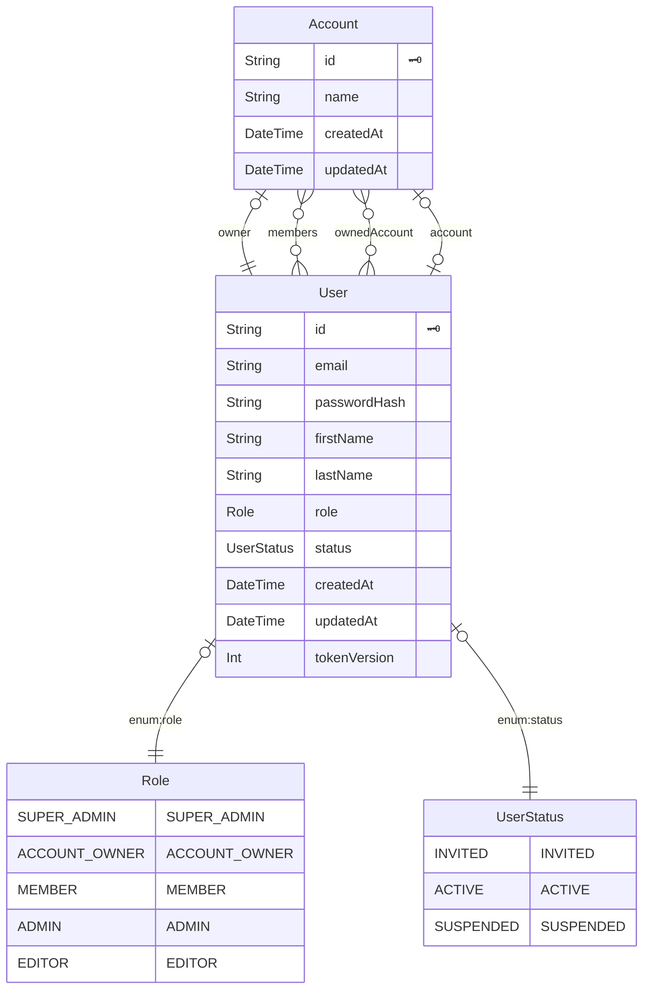

```mermaid
erDiagram

        Role {
            SUPER_ADMIN SUPER_ADMIN
ACCOUNT_OWNER ACCOUNT_OWNER
MEMBER MEMBER
ADMIN ADMIN
EDITOR EDITOR
        }
    


        UserStatus {
            INVITED INVITED
ACTIVE ACTIVE
SUSPENDED SUSPENDED
        }
    
  "Account" {
    String id "🗝️"
    String name 
    DateTime createdAt 
    DateTime updatedAt 
    }
  

  "User" {
    String id "🗝️"
    String email 
    String passwordHash 
    String firstName 
    String lastName 
    Role role 
    UserStatus status 
    DateTime createdAt 
    DateTime updatedAt 
    Int tokenVersion 
    }
  
    "Account" o|--|| "User" : "owner"
    "Account" o{--}o "User" : "members"
    "User" o|--|| "Role" : "enum:role"
    "User" o|--|| "UserStatus" : "enum:status"
    "User" o{--}o "Account" : "ownedAccount"
    "User" o|--|o "Account" : "account"
```
